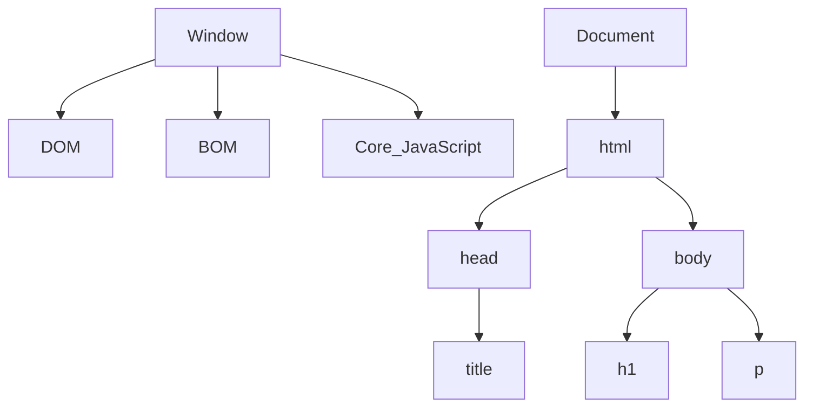
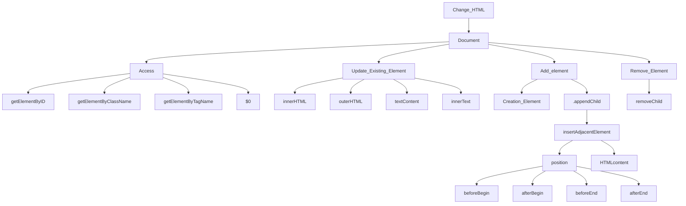

# JS DOM Manipulation 

**Window Obj ---> global Obj** &nbsp;  &nbsp;    (sab kuch window object ke ander ata hain sab isi ke child hain)

**HTML code ---> Convert JavaScript Object  ---> Document**

**HTML Tag  ---> Convert token ---> Convert node ---> Bunch of node is DOM**

## DOM Tree Structure

## DOM MANIPULATION  

**---> Manipulating HTML through JavaScript code**

